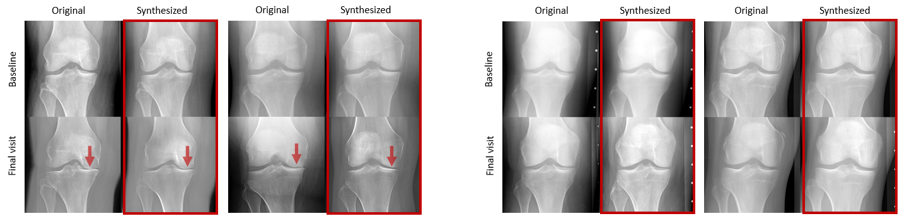
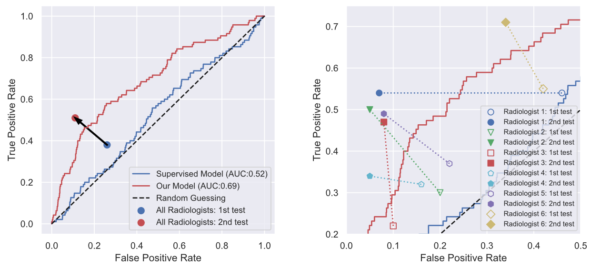

# Predicting Osteoarthritis Progression via Unsupervised Adversarial Representation Learning
(c) Tianyu Han and Daniel Truhn, RWTH Aachen University, 2021

## About
### What's included in this Repo
The repository includes the codes for data / label preparation and inferencing the future knee radiograph, training and testing the baseline classifier and also the links to the pre-trained generative model.

### Focus of the current work
Osteoarthritis (OA) is the most common joint disorder in the world affecting 10% of men and 18% of women over 60 years of age. In this paper, we present an unsupervised learning scheme to predict the future image appearance of patients at recurring visits. 
<center>
 
</center>

By exploring the latent temporal trajectory based on knee radiographs, our system predicts the risk of accelerated progression towards OA and surpasses its supervised counterpart. We demonstrate this paradigm with seven radiologists who were tasked to predict which patients will undergo a rapid progression.
<center>
 
</center>


### Requirements
```
pytorch 1.8.1
tensorboard 2.5.0
numpy 1.20.3
scipy 1.6.2
scikit-image 0.18.1
pandas
tqdm
glob
pickle5
```
- **[StyleGAN2-ADA-Pytorch](https://github.com/NVlabs/stylegan2-ada-pytorch)**   
    This repository is an official reimplementation of StyleGAN2-ADA in PyTorch, focusing on correctness, performance, and compatibility. 
- **[KNEE Localization](https://github.com/MIPT-Oulu/KNEEL)** \
    The repository includes the codes for training and testing, annotations for the OAI dataset and also the links to the pre-trained models.
- **[Robust ResNet classifier](https://github.com/peterhan91/Medical-Robust-Training)** \
    The repository contains codes for developing robust ResNet classifier with a superior performance and interpretability. 


## How to predict the future state of a knee
### Preparing the training data and labels
Download all available OAI and MOST images from https://nda.nih.gov/oai/ and https://most.ucsf.edu/. The access to the images is free and painless. You just need to register and provide the information about yourself and agree with the terms of data use. Besides, please also download the label files named  ```Semi-Quant_Scoring_SAS```  and ``` MOSTV01235XRAY.txt ``` from [OAI](https://nda.nih.gov/oai/full_downloads.html) and [MOST](https://most.ucsf.edu/), separately. 

Following the repo of [KNEE Localization](https://github.com/MIPT-Oulu/KNEEL), we utilized a [pre-trained Hourglass network](http://mipt-ml.oulu.fi/models/KNEEL/snapshots_release.tar.xz) and extracted 52,981 and 20,158 (separated left or right) knee ROI (256x256) radiographs from both OAI and MOST datasets. We further extract the semi-quantitative assessment Kellgren-Lawrence Score (KLS) from the labels files above. To better relate imaging and tabular data together, in OAI dataset, we name the knee radiographs using ```ID_BARCDBU_DATE_SIDE.png```, e.g., ```9927360_02160601_20070629_l.png```. For instance, to generate the KLS label file (`most.csv`) of the MOST dataset, one can run:
```.bash
python kls.py
```

### Training a StyleGAN2 model on radiological data
Follow the official repo [StyleGAN2](https://github.com/NVlabs/stylegan2-ada-pytorch), datasets are stored as uncompressed ZIP archives containing uncompressed PNG files.
Our datasets can be created from a folder containing radiograph images; see [`python dataset_tool.py --help`](https://github.com/NVlabs/stylegan2-ada-pytorch/blob/main/docs/dataset-tool-help.txt) for more information. 
In the auto configuration, training a OAI GAN boils down to:
```.bash
python train.py --outdir=~/training-runs --data=~/OAI_data.zip --gpus=2
```
The total training time on 2 Titan RTX cards with a resolution of 256x256 takes around 4 days to finish. The best GAN model of our experiment can be downloaded at [here]().

### Projecting training radiographs to latent space
To find the matching latent vector for a given training set, run:
```.bash
python projector.py --outdir=~/pro_out --target=~/training_set/ --network=checkpoint.pkl
```
The function `multi_projection()` within the script will generate a dictionary contains pairs of image name and its corresponding latent code and individual projection folders. 

### Synthesize future radiograph
- **require**: A pre-trained network G, test dataframe path, and individual projection folders.
To predict the baseline radiographs within the test dataframe, run: 
```.bash
python prog_w.py --network=checkpoint.pkl --frame=test.csv --pfolder=~/pro_out/ 
```

## Estimating the risk of OA progression
### 

## Baseline classifier

## License

Copyright &copy; 2021, NVIDIA Corporation. All rights reserved.

This work is made available under the [Nvidia Source Code License](https://nvlabs.github.io/stylegan2-ada-pytorch/license.html).

## Citation

```
@inproceedings{Karras2020ada,
  title     = {Training Generative Adversarial Networks with Limited Data},
  author    = {Tero Karras and Miika Aittala and Janne Hellsten and Samuli Laine and Jaakko Lehtinen and Timo Aila},
  booktitle = {Proc. NeurIPS},
  year      = {2020}
}
```

## Development

This is a research reference implementation and is treated as a one-time code drop. As such, we do not accept outside code contributions in the form of pull requests.

## Acknowledgements

We thank David Luebke for helpful comments; Tero Kuosmanen and Sabu Nadarajan for their support with compute infrastructure; and Edgar Sch&ouml;nfeld for guidance on setting up unconditional BigGAN.